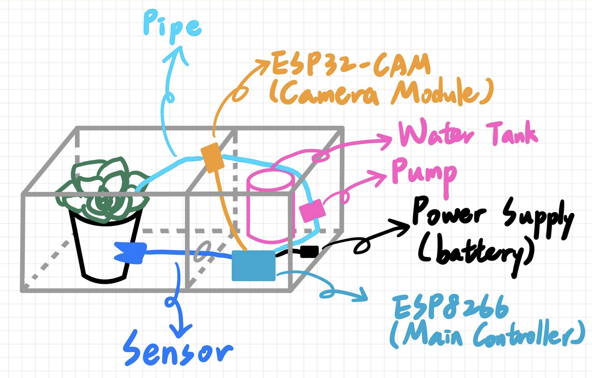
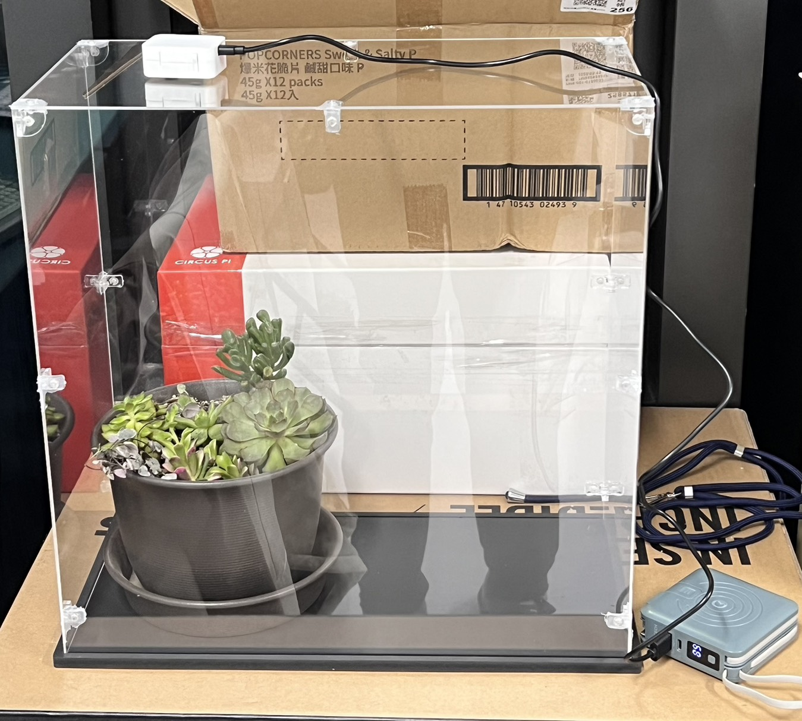
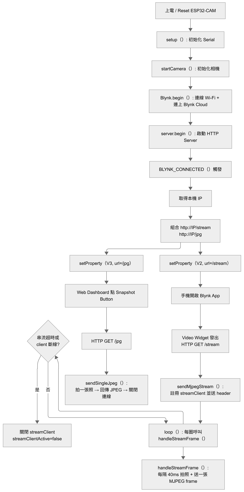
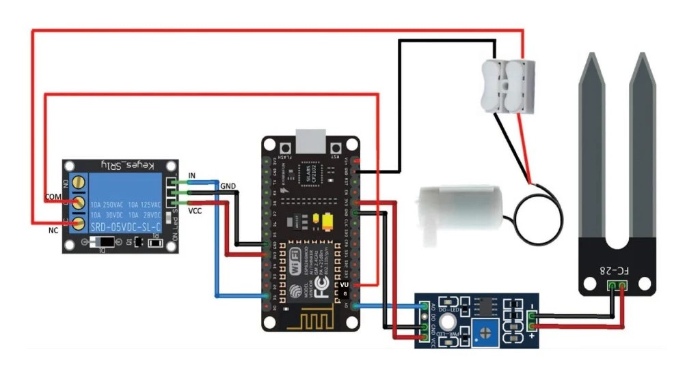
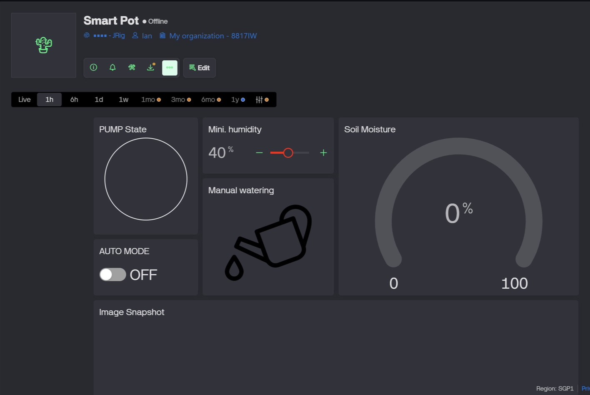

# Smart-Pot-Monitoring-System 🪴

This project integrates environmental sensing and automation using an ESP8266 controller. It transmits soil moisture and temperature data to Blynk via MQTT. The system triggers auto-irrigation when moisture drops below a threshold and enables real-time visual monitoring via ESP32-CAM.

## Project Description

### Ⅰ. Core Functions
1. **Real-time Environmental Sensing**  
Utilizes high-precision temperature and soil moisture sensors to continuously collect environmental data.

2. **Automated Irrigation System**  
Features an integrated microcontroller that analyzes sensor data and automatically activates the water pump when moisture levels fall below a specific threshold.

3. **Live Visual Monitoring**  
Employs a camera module (ESP32-CAM) to capture and track the plant’s growth and health status in real-time.

4. **Cross-Platform Data Visualization**  
Integrates with the Blynk IoT platform, enabling users to monitor sensor readings and live video feeds via a mobile app or web interface from anywhere.

### Ⅱ. Motivation

We chose this project based on two perspectives:

1. **The Micro Problem (Daily Plant Care)**  
* **Busy Lifestyles:** Due to busy schedules, people often struggle to keep their plants alive.
* **Lack of Data:** Traditional care is based on guesswork and lacks the precise data (moisture, temperature) needed for optimal plant health.

2. **The Macro Challenge (IIoT Testbed)**
* **Industrial Scale:** Modern industries rely on large-scale IIoT systems for monitoring and automation.
* **Low-Risk Prototyping:** Developing these systems in real-world environments is expensive and risky. Our project serves as a "Mini-Lab" to test the IoT lifecycle in a cost-effective way.

### Ⅲ. Objectives

Our goals are centered on delivering both practical utility and technical validation:

1. **Application Value**
* **Smart Home Integration:** To deliver a smart home application that integrates sensor data, live visuals, and remote control.
* **Enhanced Utility:** Showcasing the practical value of IoT beyond simple automated watering, creating a holistic plant-care experience.

2. **Technical Value**
* **Architecture Validation:** To validate a highly reliable and scalable cloud data architecture.
* **Scalable Foundation:** Serving as a technical foundation for future expansion into complex industrial scenarios, such as large-scale greenhouse automation.

## Product Design
      

## System Architecture

Our system is built on a three-layer IoT architecture, ensuring seamless integration between hardware sensing, logic control, and cloud visualization.

### Ⅰ. Main Components
* System Logic Controller (NodeMCU ESP8266) 
* Independent Vision Unit (ESP32-CAM)
* Perception Module
* Irrigation Actuator

### Ⅱ. System Functions
To ensure a robust IIoT testbed, the functions are organized as follows:
* Monitor 
* Actuation 
* Data Platform

### Ⅲ. Architecture Diagram
 

* **ESP32-CAM Software Logic & Execution Flow**

* **Blynk Cloud & ESP32-CAM Integration Architecture**
 

## Hardware

### Ⅰ. Components and Specifications
* ESP8266
* ESP32-CAM
* Soil Moisture Sensor
* 1-Channel Relay & 5V Water Pump

### Ⅱ. Connections and System Design
The hardware design emphasizes power isolation and precise signal routing.

#### **Wiring Diagram**
 

## Software

### Ⅰ. Features
* **Smart Automated Irrigation:** Threshold-based triggering with real-time moisture feedback.
* **Safety Fail-safe System:** High-frequency (200ms) safety timer to prevent pump over-execution.
* **Real-Time Analytics:** Continuous tracking of moisture, temperature, and humidity.
* **Live Video Feed:** 25 FPS MJPEG streaming and instant snapshots via ESP32-CAM.
* **Dual-Platform Access:** Synchronized control via mobile and web interfaces.

### Ⅱ. Requirements
* **Software:** Arduino IDE (v2.0+), Blynk IoT Cloud account.
* **Libraries:** `BlynkSimpleEsp8266`, `DHT sensor library`, `ESP32_Camera`.
* **Hardware Environment:** ESP8266 & ESP32-CAM setup as defined in [Hardware](#hardware).
* **Network:** Stable 2.4GHz Wi-Fi connection.

### Ⅲ. Visualization
The system utilizes the Blynk IoT platform to provide a monitoring experience across devices.  

* **Web Dashboard**
 

* **Mobile App Interface**

## Marketing

### Ⅰ. Usage Scenarios
We have identified four primary scenarios where our Smart Pot Monitoring System provides significant value:

* **Smart Home Integration:** 
Perfect for standard potted plants in offices, balconies, or rental apartments. It allows you to "smarten up" your existing soil-based plants without the need to switch to complex hydroponic systems.
* **Remote Care & Travel:** 
Designed for busy professionals or frequent travelers. With real-time data, live video, and automated watering, you can manage your greenery from anywhere in the world with total peace of mind.
* **Scaled Management:** 
Our system is modular, meaning you can easily scale it up to monitor many plants at once. Manage multiple pots in different areas, like your living room and balcony, all from a single dashboard.
* **Starter Kit for Precision Agriculture:** 
In the future, professional sensors for parameters like EC, pH, or light can be added. This serves as an excellent starting point for small-scale, indoor precision farming.

### Ⅱ. Competitive Analysis

Our system provides a more observable and cost-effective solution compared to existing commercial products. By utilizing an open IoT architecture, we bridge the gap between simple monitoring and active plant care.

| Existing Products | Core Features | Our Competitive Advantages |
| :--- | :--- | :--- |
| **Click & Grow** | Capsule-based cultivation with automatic watering and lighting; closed app ecosystem. | • **Cheaper:** Built on a modular open IoT architecture. • **Real-Time Visual Monitoring:** Integrated camera feed to see plant health directly. |
| **AeroGarden** | Automated indoor hydroponic system focusing on water-based growth and lighting. | • **Comprehensive Sensing:** Includes soil moisture and temperature sensors. • **Smart Irrigation:** Waters based on real-time soil conditions, not fixed routines. |
| **FYTA Beam** | Sensor-based monitoring providing data-driven recommendations via app. | • **Automated Action:** Provides direct irrigation control based on data, not just alerts. • **Integrated Dashboards:** Cross-platform monitoring and automated action through Cloud IoT. |

## Website & Source Code
* **Project Website:** [Smart Pot Monitoring System - Official Website](https://tsaiyuwang.wixsite.com/smart-pot-monitoring)
* **Source Code:** [Found in /src folder](./src)

## About Us
| Team Member | Student ID | Responsibilities |
| :--- | :--- | :--- |
| 徐文彬 | M11451013 | Hardware |
| 王才瑜 | M11451015 | Website |
| 呂羿樺 | M11451017 | Software |
| 蔡婉煜 | M11451028 | Github |

